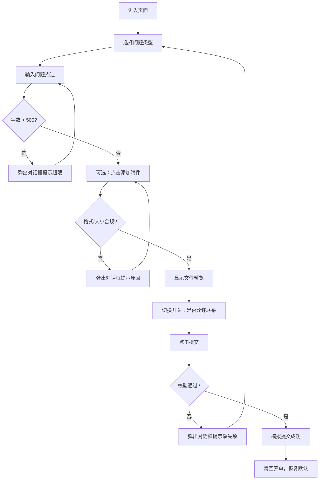

# 问题反馈页面 — 开发文档

## 一、页面概述

| 项目 | 说明 |
|------|------|
| 页面名称 | 问题反馈 |
| 页面用途 | 收集用户反馈的问题信息，包括问题类型、详细描述、截图附件及联系方式授权 |
| 技术方案 | 纯 HTML + CSS + JavaScript（单文件，无框架依赖） |
| 响应式 | 支持桌面端与移动端自适应 |

---

## 二、页面结构与组件

```
问题反馈页
├── 1. 问题类型选择（必选）
│   ├── ○ 网络问题
│   └── ○ 非网络问题
├── 2. 问题描述（文本输入框）
│   └── 字数统计提示
├── 3. 添加附件按钮
│   └── 文件预览区
├── 4. 开关：是否允许主动联系用户
└── 5. 提交按钮
```

---

## 三、组件详细规范

### 3.1 问题类型选择

| 属性 | 规则 |
|------|------|
| 类型 | 单选按钮组（Radio） |
| 选项 | 「网络问题」「非网络问题」 |
| 默认状态 | 均未选中 |
| 是否必选 | 是 |
| 校验规则 | 提交时若未选中，阻止提交并弹出对话框提示："请选择问题类型" |
| 视觉要求 | 选中项有明显高亮/填充状态，未选中为空心圆 |

### 3.2 问题描述文本框

| 属性 | 规则 |
|------|------|
| 类型 | 多行文本输入框（`<textarea>`） |
| 占位提示 | "请描述您遇到的问题..." |
| 最大字数 | 500 字 |
| 字数显示 | 输入框右下角实时显示 "已输入 X/500" |
| 校验规则 | 输入过程中若字数超过 500，弹出对话框提示："问题描述不能超过500字"，并截断超出部分 |
| 是否必填 | 是（提交时若为空，阻止提交并提示） |

### 3.3 添加附件

| 属性 | 规则 |
|------|------|
| 按钮文案 | "添加附件" |
| 接受格式 | 仅 `.jpg` / `.jpeg` |
| 文件大小上限 | 10 MB |
| 校验规则 | 若格式非 jpg/jpeg，弹出对话框提示："仅支持 JPG 格式的图片"；若大小超过 10MB，弹出对话框提示："附件大小不能超过10MB" |
| 交互细节 | 点击按钮触发隐藏的 `<input type="file">` ；上传成功后在按钮下方显示文件缩略图预览及文件名，并提供删除按钮 |
| 可上传数量 | 1 张（如需多张可扩展） |

### 3.4 开关 — 是否允许主动联系用户

| 属性 | 规则 |
|------|------|
| 标题文案 | "是否允许主动联系用户" |
| 类型 | Toggle Switch 开关 |
| 默认状态 | 关闭（OFF） |
| 开启文案 | 可选显示"是"/"否" 或无文案 |

### 3.5 提交按钮

| 属性 | 规则 |
|------|------|
| 按钮文案 | "提交" |
| 样式 | 主色调填充按钮，全宽或居中 |
| 点击行为 | 1. 校验所有必填项；2. 校验通过后，以 `console.log` 或 `alert` 模拟提交成功；3. 校验不通过，弹出对话框提示具体原因 |
| 提交后 | 清空表单，恢复默认状态 |

---

## 四、校验规则汇总

| 序号 | 校验项 | 触发时机 | 提示语 |
|------|--------|----------|--------|
| 1 | 问题类型未选 | 点击提交时 | "请选择问题类型" |
| 2 | 问题描述为空 | 点击提交时 | "请输入问题描述" |
| 3 | 问题描述超 500 字 | 输入时实时 | "问题描述不能超过500字" |
| 4 | 附件格式非 jpg | 选择文件后 | "仅支持 JPG 格式的图片" |
| 5 | 附件大小超 10MB | 选择文件后 | "附件大小不能超过10MB" |

> **提示方式**：所有校验均使用自定义对话框（Modal Dialog），不使用浏览器原生 `alert()`。

---

## 五、视觉设计建议

| 项目 | 建议 |
|------|------|
| 配色 | 主色调：`#1677FF`（蓝色）；背景：`#F5F7FA`；卡片：`#FFFFFF` |
| 字体 | 系统默认无衬线字体 |
| 圆角 | 卡片圆角 12px，按钮圆角 8px，输入框圆角 6px |
| 间距 | 组件间距 24px，卡片内边距 24px |
| 页面布局 | 内容区居中，最大宽度 600px，移动端自适应 |

---

## 六、文件结构

```
feedback.html    ← 单文件，包含 HTML + CSS + JavaScript
```

---

## 七、交互流程图



---

## 八、待确认事项

- 附件是否需要支持多张上传？
- 提交成功后是否需要跳转页面？
- 是否需要暗色模式支持？
- 配色方案是否满意？
